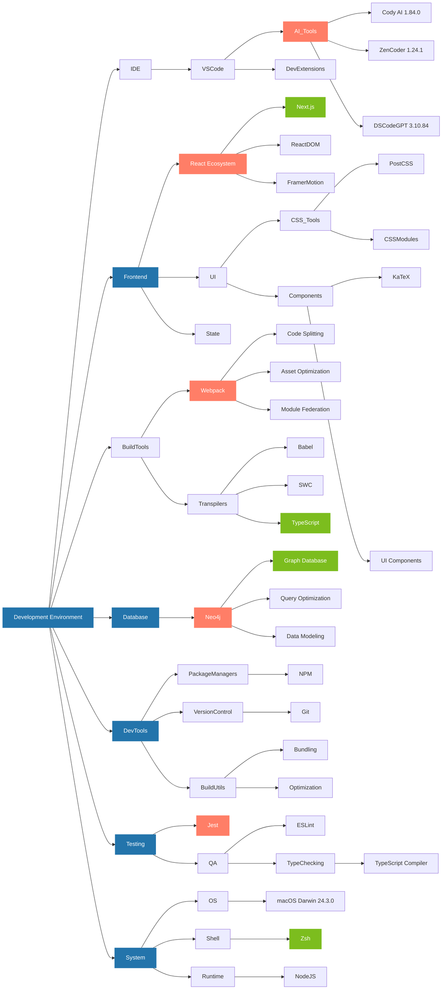

# WiStack

```mermaid
graph LR
%% Main Categories
Root[Development Environment] --> IDE
Root --> Frontend
Root --> BuildTools
Root --> Database
Root --> DevTools
Root --> Testing
Root --> System

%% IDE and Extensions
IDE --> VSCode
VSCode --> AI_Tools
VSCode --> DevExtensions
AI_Tools --> Cody[Cody AI 1.84.0]
AI_Tools --> ZenCoder[ZenCoder 1.24.1]
AI_Tools --> DSCodeGPT[DSCodeGPT 3.10.84]

%% Frontend Stack
Frontend --> React[React Ecosystem]
React --> NextJS[Next.js]
React --> ReactDOM
React --> FramerMotion

Frontend --> UI
UI --> CSS_Tools
CSS_Tools --> PostCSS
CSS_Tools --> CSSModules

UI --> Components
Components --> KaTeX
Components --> CustomUI[UI Components]

Frontend --> State

%% Build Tools
BuildTools --> Webpack
Webpack --> CodeSplit[Code Splitting]
Webpack --> AssetOpt[Asset Optimization]
Webpack --> ModuleFed[Module Federation]

BuildTools --> Transpilers
Transpilers --> Babel
Transpilers --> SWC
Transpilers --> TypeScript

%% Database
Database --> Neo4j
Neo4j --> GraphDB[Graph Database]
Neo4j --> QueryOpt[Query Optimization]
Neo4j --> DataModel[Data Modeling]

%% Development Tools
DevTools --> PackageManagers
PackageManagers --> NPM

DevTools --> VersionControl
VersionControl --> Git

DevTools --> BuildUtils
BuildUtils --> Bundling
BuildUtils --> Optimization

%% Testing Framework
Testing --> Jest

Testing --> QA
QA --> ESLint
QA --> TypeChecking
TypeChecking --> TSC[TypeScript Compiler]

%% System Environment
System --> OS
OS --> MacOS[macOS Darwin 24.3.0]

System --> Shell
Shell --> Zsh

System --> Runtime
Runtime --> NodeJS

%% Styling
classDef primary fill:#2374ab,stroke:#2374ab,stroke-width:2px,color:#fff
classDef secondary fill:#ff7e67,stroke:#ff7e67,stroke-width:2px,color:#fff
classDef tertiary fill:#7cbd1e,stroke:#7cbd1e,stroke-width:2px,color:#fff

class Root,Frontend,Database,DevTools,Testing,System primary
class React,Webpack,Neo4j,AI_Tools,Jest secondary
class TypeScript,NextJS,GraphDB,Zsh tertiary
```
